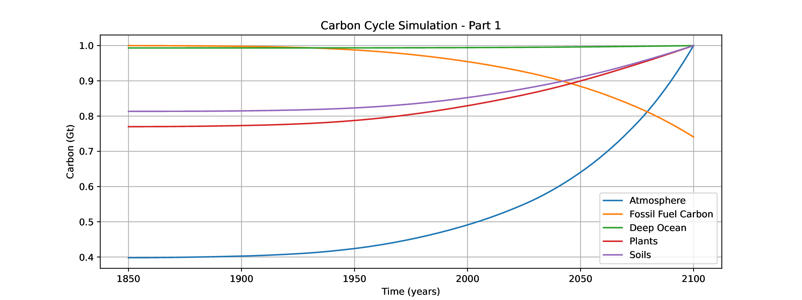

# Carbon Project

Numerical simulation of a simplified carbon cycle using an explicit Euler integrator in Python.



## Overview

This project models exchanges of carbon between 8 reservoirs:

1. Atmosphere
2. Carbonate rock
3. Deep ocean
4. Fossil fuel carbon
5. Plants
6. Soils
7. Surface ocean
8. Vegetated land area (%)

The main script (`carbone.py`) computes time evolution from 1850 to 2100 and generates normalized plots for selected variables.

## Repository Tree

```text
Carbon Project/
├── .git/
├── .gitignore
├── README.md
├── carbone.py
├── consigne.pdf
├── explanation.pdf
└── data/
    └── ...
```

## Requirements

- Python 3.10+
- `numpy`
- `matplotlib`

Install dependencies:

```bash
pip install numpy matplotlib
```

## Run

From the project root:

```bash
python3 carbone.py
```

## Current Simulation Settings

In `main()`:

- Start year: `1850`
- End year: `2100`
- Time step: `0.1` year

## Output

Running the script displays the figure and also saves it to:

- `./data/carbon_simulation.pdf`

## Notes

- `@njit` (Numba) decorators are currently commented out.
- Fossil-fuel combustion is computed from piecewise linear interpolation of `FossFuelData`.
- The numerical scheme is forward Euler (`step` function).
